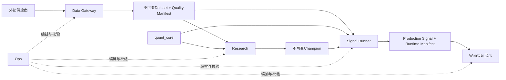

# 架构入口

本目录描述`ashare-pilot-next`当前有效的架构。仓库从空白根开始，旧项目只作为
外部审计来源，不能成为构建或运行依赖。

## 已接受决定

| 决定 | 内容 |
|---|---|
| [ADR-001](decisions/ADR-001-clean-successor.md) | 新项目与旧项目物理隔离 |
| [ADR-002](decisions/ADR-002-authority-boundaries.md) | `quant_core`、Research和Signal Runner职责 |
| [ADR-003](decisions/ADR-003-versioned-datasets.md) | 历史研究和生产推理使用不可变数据集 |
| [ADR-004](decisions/ADR-004-universe-contracts.md) | Universe是策略绑定的版本化合同 |
| [ADR-005](decisions/ADR-005-state-and-holdings.md) | 降级状态和真实持仓边界 |

## 依赖方向

Data Gateway不定义策略，Research不发布未晋级策略，Signal Runner不训练，Web
不计算金融语义，Ops不决定仓位。

## 配套文件

- [合同总账](CONTRACT_CATALOG.md)
- [依赖规则](DEPENDENCY_RULES.md)
- [状态机](STATE_MACHINE.md)
- [迁移政策](MIGRATION_POLICY.md)
- [实证能力重建记录](EVIDENCE_REIMPLEMENTATION.md)
- [首期验收标准](ACCEPTANCE.md)
