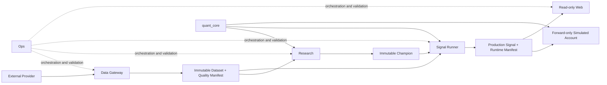

# Architecture Entry Point

This directory describes the architecture currently in force for
`ashare-pilot-next`. The repository starts from an empty Git root; the legacy
project is only an external audit source and can never become a build or runtime
dependency.

## Accepted Decisions

| Decision | Content |
|---|---|
| [ADR-001](decisions/ADR-001-clean-successor.md) | Physical isolation from the legacy project |
| [ADR-002](decisions/ADR-002-authority-boundaries.md) | Responsibilities of `quant_core`, Research, and Signal Runner |
| [ADR-003](decisions/ADR-003-versioned-datasets.md) | Historical research and production inference read immutable datasets |
| [ADR-004](decisions/ADR-004-universe-contracts.md) | Universe is a versioned, strategy-bound contract |
| [ADR-005](decisions/ADR-005-state-and-holdings.md) | Degraded states and the real-holdings boundary |

## Dependency Direction

```mermaid
flowchart LR
  provider["External Provider"] --> gateway["Data Gateway"]
  gateway --> dataset["Immutable Dataset + Quality Manifest"]
  dataset --> research["Research"]
  dataset --> runner["Signal Runner"]
  core["quant_core"] --> research
  core --> runner
  research --> champion["Immutable Champion"]
  champion --> runner
  runner --> signal["Production Signal + Runtime Manifest"]
  signal --> sim["Forward-only Simulated Account"]
  core --> sim
  signal --> web["Read-only Web"]
  ops["Ops"] -.orchestration and validation.-> gateway
  ops -.orchestration and validation.-> research
  ops -.orchestration and validation.-> runner
  ops -.orchestration and validation.-> web
```

Data Gateway does not define strategies. Research does not publish unpromoted
strategies. Signal Runner does not train. Web does not compute financial
semantics. The Simulated Account consumes committed signals and never claims
broker execution. Ops does not decide positions.

## Companion Files

- [Contract Catalog](CONTRACT_CATALOG.md)
- [Dependency Rules](DEPENDENCY_RULES.md)
- [State Machine](STATE_MACHINE.md)
- [Migration Policy](MIGRATION_POLICY.md)
- [Evidence Reimplementation Record](EVIDENCE_REIMPLEMENTATION.md)
- [Foundation Acceptance](ACCEPTANCE.md)
